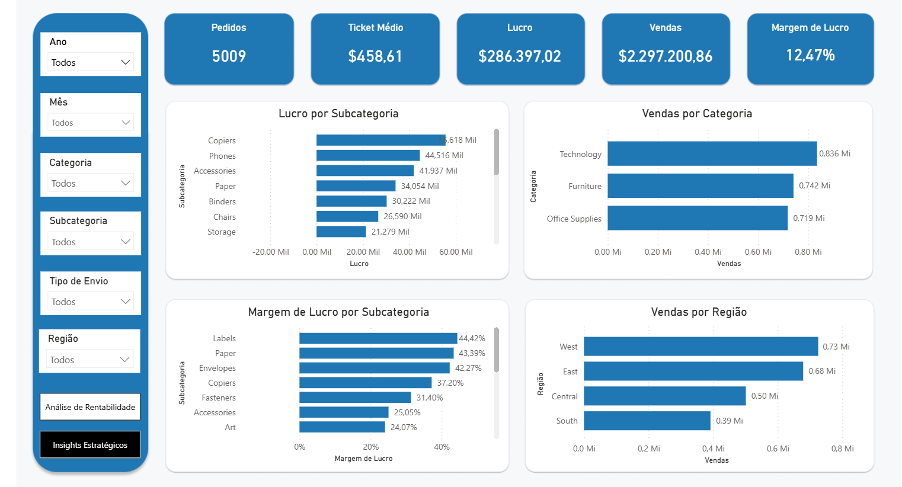
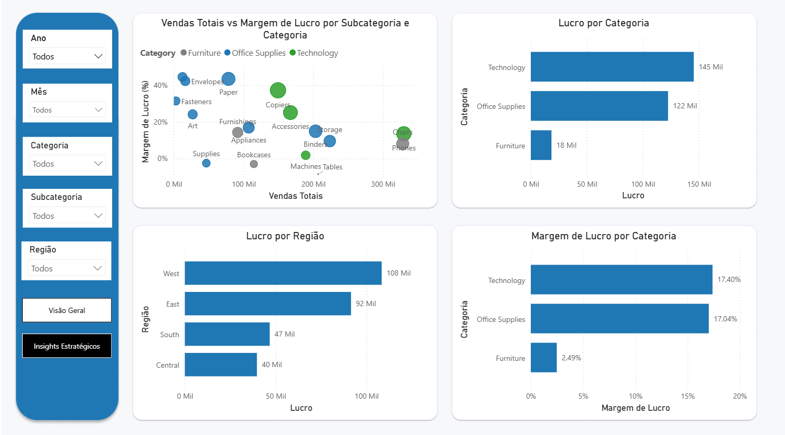
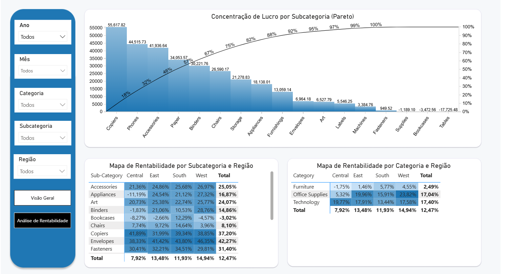

# Análise de Vendas, Rentabilidade e Estratégia de Negócio - Power BI

## 📌 Visão Geral do Projeto

Este projeto tem como objetivo analisar o desempenho comercial de uma empresa, indo além do faturamento e focando em **lucro**, **margem** e **eficiência**, utilizando o **Power BI** como ferramenta principal de análise e visualização.

O dashboard foi estruturado em **três camadas analíticas**, simulando a forma como dados são explorados em ambientes corporativos: **visão geral → análise de rentabilidade → insights estratégicos**.

## 📊 Principais Análises

- **Lucro por categoria e subcategoria**, identificando os principais drivers de resultado
- **Margem de lucro por região**, destacando áreas de alta e baixa eficiência
- **Rentabilidade por subcategoria**, evidenciando produtos estratégicos e gargalos
- **Concentração de lucro (Pareto)** para priorização de foco comercial

## 💡 Insights de Negócio

- O lucro está concentrado em poucas subcategorias, reforçando a importância do foco estratégico
- Existem categorias com alto volume, mas margem inferior, indicando oportunidades de otimização
- Diferenças regionais relevantes sugerem ajustes de mix de produtos e precificação

## 🗃️ Dataset

- Fonte: [Tableau Sample Data](https://public.tableau.com/app/learn/sample-data)
- Arquivo local: `data/sample_-_superstore.xls`

## ▶️ Como abrir

1. Abra `powerbi/powerbi-superstore.pbix` no **Power BI Desktop**.
2. Se necessário, aponte a fonte para `data/sample_-_superstore.xls`.

## 🌐 Acesse o Dashboard Online

- **Link (Power BI Service / Publicação)**: [Acessar dashboard no Power BI](https://app.powerbi.com/view?r=eyJrIjoiNWU0ZWFkOTYtOTVlMy00YjU2LTg5NjgtNTcxM2YyYjk5MmVlIiwidCI6IjI4NDVhN2ExLWQ3ZTMtNDBjNC1hMGYwLWY4NWI5OWY2Mjc2YyJ9)

## 🖼️ Screenshots

Capturas de tela do dashboard:

- **Visão Geral**
  - 
- **Análise de Rentabilidade**
  - 
- **Insights Estratégicos**
  - 

## 📁 Estrutura do projeto

```text
powerbi-superstore/
├─ .gitattributes
├─ LICENSE
├─ README.md
├─ powerbi/
│  └─ powerbi-superstore.pbix
├─ data/
│  └─ sample_-_superstore.xls
├─ prints-dashboard/
│  ├─ imagem1.png
│  ├─ imagem2.png
│  └─ imagem3.png
└─ background-dashboard/
   ├─ imagem1.png
   ├─ imagem2.png
   └─ imagem3.png
```

## 🛠️ Tecnologias

Power BI, Power Query e DAX.


## 📄 Licença

Este projeto está sob a licença MIT. Veja o arquivo LICENSE para mais detalhes.


## 👨‍💻 Desenvolvedor

**Leonardo Serpa** 


